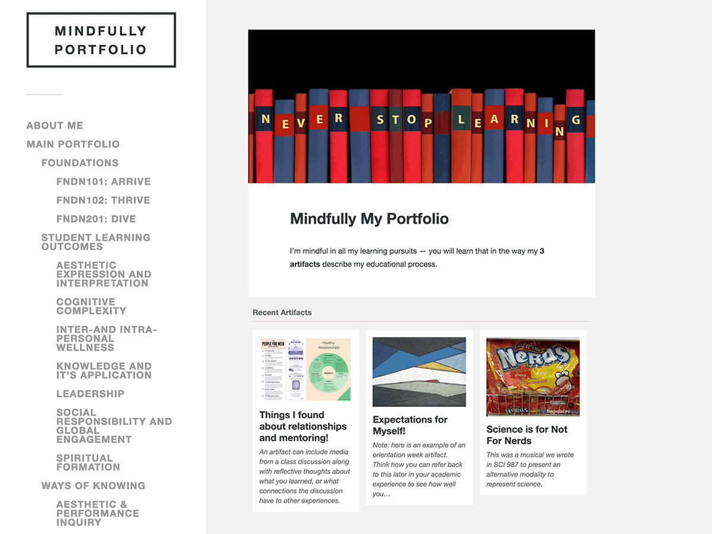

# TWU Spartans Portfolio

* a [cog.dog](https://cog.dog) production

A modern portfolio theme focused on showcasing your work in a clean and minimal way (child of [Fukasawa](https://en-ca.wordpress.org/themes/fukasawa/)) recommended for [Trinity Western University](https://twu.ca/) students to create their learning portfolio. 

## About

One of a series of WordPress child themes developed for Trinity Western University. To work as a portfolio, this requires (and will nag on a new site if not present) the [TWU Portfolio Helper plugin](https://github.com/TWUOnline/TWU-Portfolio-Helper) which creates a custom post type for portfolio artifacts as well as a custom taxonomies for organizing them. The plugin also provides shortcodes for flexible display of portfolio information anywhere in a site.

This theme is designed to be used as a template that is cloned for a new site, but it does provide internally the information on how to set up the front page (a custom template to display the most recent artifacts).

The theme also adds a special admin menu with links to portfolio guides as well as a section on how to customize the theme http://create.twu.ca/eportfolios/portfolio-themes/twu-spartans/

## See it in Action

This is the site used to clone for new portfolios https://create.twu.ca/portfolio-spartans/

## Other TWU Portfolio themes

* TWU Hearts Portfolio Theme https://github.com/TWUOnline/TWU-Hearts-Portfolio
* TWU Inspire Portfolio Theme https://github.com/TWUOnline/TWU-Inspire-Portfolio
* TWU Minds Portfolio Theme https://github.com/TWUOnline/TWU-Minds-Portfolio
